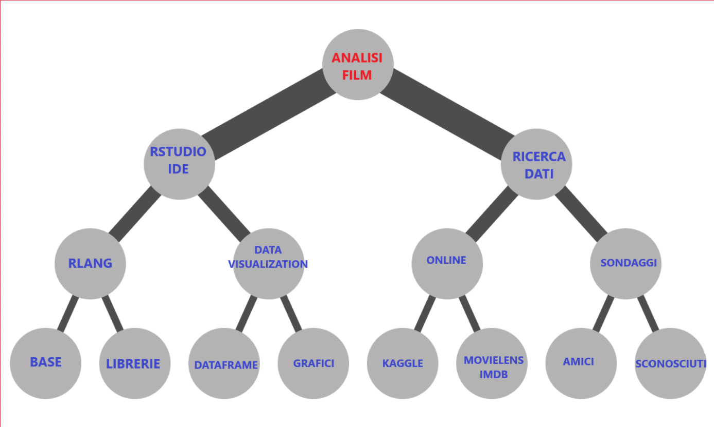
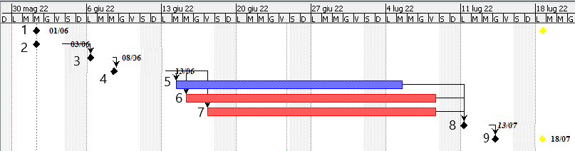
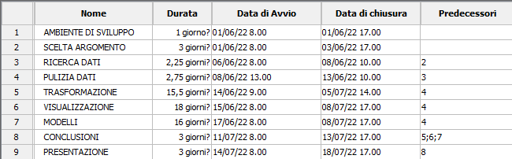

```{r setup, include=FALSE}
knitr::opts_chunk$set(echo = TRUE)
```

# **INTRODUZIONE**

### FLOWCHART

{width="1200"}





### STRUMENTI

-   RSTUDIO

    -   READR (import data)

    -   TIDYR (tidy)

    -   DPLYR (transform)

    -   MODELR (model)

    -   SHINY; GGPLOT (visualize)

### FONTE DEI DATI

-   [KAGGLE-imdb](https://www.kaggle.com/datasets/ashirwadsangwan/imdb-dataset)

-   [MOVIELENS-userinfo + ZIPCODES](https://grouplens.org/datasets/movielens/1m/)

-   [Movie Sequels](https://data.world/priyankad0993/sequels)

-   [AMAZON](https://www.kaggle.com/datasets/shivamb/amazon-prime-movies-and-tv-shows)

-   [NETFLIX](https://www.kaggle.com/datasets/shivamb/netflix-shows)

-   [DISNEY+](https://www.kaggle.com/datasets/shivamb/disney-movies-and-tv-shows)

-   [hollywood](https://www.kaggle.com/datasets/johnharshith/hollywood-theatrical-market-synopsis-1995-to-2021?select=HighestGrossers.csv)

-   [tmdb](https://www.kaggle.com/datasets/rakeshsahni/tmdb-popular-movies)

# DOMANDE

-   i film con più alto gross sono più presenti nelle varie piattaforme netflix, amazon?

-   categorizzare i film in base alla location degli user

-   numero di film in base al genere prevalente

-   mappe con zipcodes

-   numero di voti da varie regioni

-   gross / avarage rating

-   film preferiti delle annate correlati alla mentalità?

-   trovare film con protagonisti deceduti nella vita reale

-   Trovare i film più visti con i sequel

-   correlazione sequel rating

-   CREARE UNA CORRISPONDENZA DEI FILM TRA LE 3 PIATTAFORME (DISNEY, NETFLIX, AMAZON)
