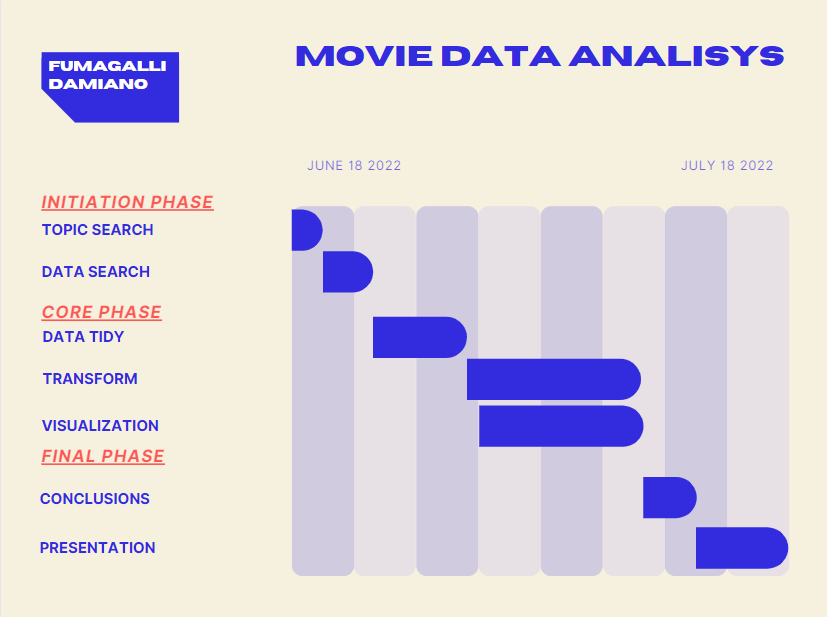

```{r setup, include=FALSE}
knitr::opts_chunk$set(echo = TRUE)

# source("../../app.R")
```

# INDEX

-   [ENVIRONMENT]

-   [IMPORT DATA](./IMPORT/Import.html)

-   [DATA TIDY](./TIDY/Tidy.html)

-   [TRANSFORM + VISUALIZE](./TRANSFORM/Transform.html)

-   [CONCLUSIONS](./CONCLUSIONS/Conclusions.html)

# ENVIRONMENT

{width="115"} [cheatsheets](https://www.rstudio.com/resources/cheatsheets/)

-   [READR](../CHEATSHEETS/readr.pdf){target="_blank"} --\> (IMPORT DATA)

-   [TIDYR](../CHEATSHEETS/tidyr.pdf){target="_blank"} --\> (DATA TIDY)

-   [DPLYR](../CHEATSHEETS/dplyr.pdf){target="_blank"} --\> (TRANSFORM)

-   [SHINY](../CHEATSHEETS/shiny.pdf){target="_blank"}; [GGPLOT](../CHEATSHEETS/ggplot.pdf){target="_blank"} (VISUALIZE)



# DATA SOURCES

-   [AMAZON](https://www.kaggle.com/datasets/shivamb/amazon-prime-movies-and-tv-shows)

-   [DISNEY+](https://www.kaggle.com/datasets/shivamb/disney-movies-and-tv-shows)

-   [HIGH GROSS](https://www.kaggle.com/datasets/sanjeetsinghnaik/top-1000-highest-grossing-movies)

-   [MOVIELENS-userinfo](https://grouplens.org/datasets/movielens/1m/)

    -   [ZIPCODES](https://simplemaps.com/data/us-zips)

-   [NETFLIX](https://www.kaggle.com/datasets/shivamb/netflix-shows)

-   [OSCARS](https://www.kaggle.com/datasets/dharmikdonga/academy-awards-dataset-oscars)

-   [SEQUELS](https://data.world/priyankad0993/sequels)

# SUBTOPICS

-   [INFO](./TIDY/FileDim.html): CLEANING DATA --\> LESS PC RESOURCES

-   [APP](./): Reccomendation System

    -   MOVIES / TV-SHOWS

    -   GENRE

    -   YEAR

    -   STREAMING SERVICES

    -   RATING

-   [MOVIELENS-APP](./TRANSFORM/Movielens.html)

    -   MAPPING USER LOCATIONS BY...

        -   OCCUPATION

        -   MOVIE GENRE

-   [GROSS](./TRANSFORM/Gross.html):

    -   [GROSS / YEAR](./TRANSFORM/Gross.html#yearMap)

    -   [AMAZON](./TRANSFORM/Gross.html#unitingData)

    -   [DISNEY](./TRANSFORM/Gross.html#unitingData)

    -   [NETFLIX](./TRANSFORM/Gross.html#unitingData)

-   [OSCARS](./TRANSFORM/Oscars.html#interactivePlot): INTERACTIVE PLOT

-   [SEQUELS](./TRANSFORM/Sequel.html): MAP
