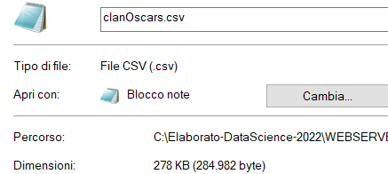
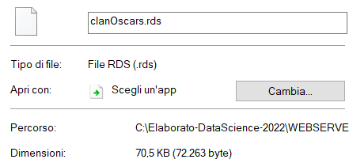
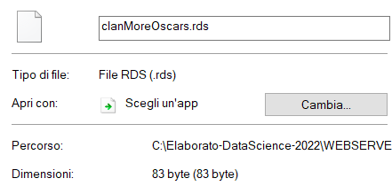
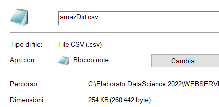
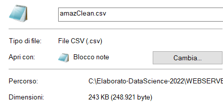
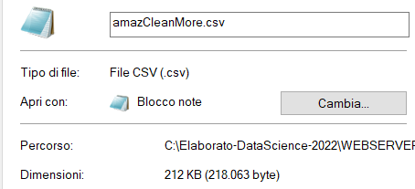

```{r setup, include=FALSE}
knitr::opts_chunk$set(echo = TRUE)
library(readr)
library(microbenchmark)
library(dplyr)
```

# FILE TYPE {#fileType}

-   CSV (Comma Separated Values) is the best solution if you want to open these files with other analysis software, such as Excel

-   RDS (R Data Structure) preserves the column types and reduces the file dimensions

```{r}

dirtyOscars = read_delim("../../DATASETS/OSCARS/oscars.csv",delim=";")
spec(dirtyOscars)
(winnerValues = unique(dirtyOscars$winner))
typeof(winnerValues)

clanOscars = dirtyOscars %>% mutate(winner = (winner == "VERO"), year = as.integer(year_film)) %>% select(film,year,winner)

clanMoreOscars = dirtyOscars %>% mutate(winner = ifelse(winner == "VERO",1L,0L), year = as.integer(year_film)) %>% select(film,year,winner)

(winnerValues = unique(clanOscars$winner))
typeof(winnerValues)

#SAVING IN CSV FORMAT
cleanCSVPath = "./datasets/clanOscars.csv"
write_csv(clanOscars,cleanCSVPath)
# RDS FORMAT
cleanRDSPath = "./datasets/clanOscars.rds"
saveRDS(clanOscars,cleanRDSPath)

clanMoreRDSPath = "./datasets/clanMoreOscars.rds"
saveRDS(clanMoreRDSPath,clanMoreRDSPath)


compare <- microbenchmark(read_csv(cleanCSVPath,show_col_types = FALSE),   readRDS(cleanRDSPath),  times = 10)

compare 


# READING DATA

oscarsCSV = read_csv(cleanCSVPath,show_col_types = FALSE)
oscarsRDS = readRDS(cleanRDSPath)

head(oscarsCSV)
head(oscarsRDS)


```

### FILE DIMENSIONS







# AMAZON DATASETS

```{r}
amazDirty = read_csv("../../DATASETS/AMAZON/amazon.csv") %>% select(title,type)
amazClean = amazDirty  %>% mutate(movie = (type=="Movie"))
amazCleanMore = amazDirty  %>% mutate(movie = ifelse(type=="Movie",1L,0L))
```

```{r}
spec(amazDirty)
levels(factor(amazDirty$type))
spec(amazClean)
levels(factor(amazClean$movie))
spec(amazCleanMore)
levels(factor(amazCleanMore$movie))
# 1 = TRUE, 0 = FALSE

write_csv(amazDirty,"./datasets/amazDirt.csv")
write_csv(amazClean,"./datasets/amazClean.csv")
write_csv(amazCleanMore  ,"./datasets/amazCleanMore.csv")

paste("ALL FILES HAVE"  , nrow(amazClean) , "ROWS")
nMovies = nrow(amazClean %>% filter(movie)) 
paste("THERE ARE",nMovies,"MOVIES, THE OTHERS ARE TV-SHOWS") 

print("1 CHARACTER = 1 BYTE")
```

### DIRTY



-   TOTAL DIMENSION = 260442 Bytes

-   "Movie" = 5char \* 1Byte/char = 5Bytes --\> 5Bytes \* 7814 = 39070Bytes

-   "Tv Show" = 7char \* 1Byte/char = 7 Bytes --\> 7 Bytes \* (9668-7814) = 12978 Bytes

-   TYPE = 39070Bytes + 12978 Bytes = 52048 Bytes

-   REMAINING = 260442 - 52048 = 208394 Bytes

    -   208395 - 208394 = 1Byte --\> the difference between "MOVIE" and "TYPE" is 1 character

### CLEAN



-   TOTAL DIMENSION = 244 KBytes = 248921 Bytes

-   "TRUE" = 4char \* 1Byte/char = 4Bytes --\> 4Bytes \* 7814 = 31256 Bytes

-   "FALSE" = 5char \* 1Byte/char = 5Bytes --\> 5Bytes \* (9668-7814) = 9270 Bytes

-   MOVIE = 31256 Bytes + 9270 Bytes = 40526 Bytes

-   REMAINING = 248921 - 40526 = 208395 Bytes

### CLEAN MORE



-   TOTAL DIMENSION = 218063 Bytes

-   "0" and "1" have 1 char

-   1char \* 1Byte/char = 1Byte --\> 1\*9668 = 9668 Bytes

-   REMAINING = 218063 - 9668 = 208395

# CONCLUSIONS

-   Saving the files according to the [CLEAN MORE] format allows RSTUDIO to intepret the data as logical. Accessing and Checking operations are faster and easier

-   the three datasets provide the same amount of information, so the larger the file size, the greater the redundancy will be
